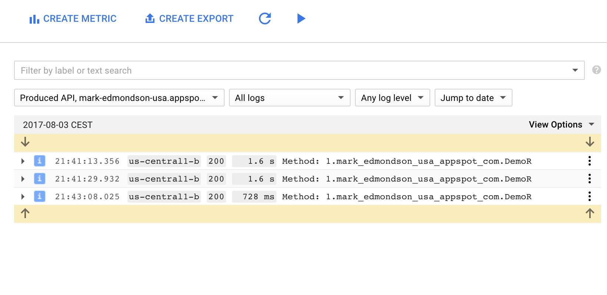
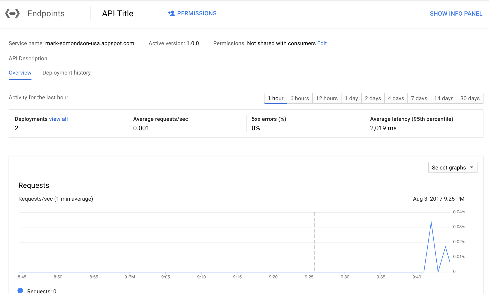

Creating a serverless R API on Google Cloud Platform
================
Mark Edmondson
8/3/2017

R + containerit + Google Build triggers + GitHub + Plumber + Swagger (OpenAPI) + App Engine + Google Cloud Endpoints = a serverless, scalable R API, that can be called by non-R SDKs, built in OAuth2 and auth keys and monitoring

Deploy to App Engine
--------------------

1.  Install [plumber](https://www.rplumber.io/), [containerit](https://github.com/o2r-project/containerit), and the python [gcloud SDK](https://cloud.google.com/sdk/downloads)

Below is taken from the guide [here](demoDockerAppEngine/README.md), which has more detail.

1.  Create a plumber R script with endpoints for your R code
2.  Use `library(containerit)` to create a Dockerfile of the dependents your R code needs
3.  Alter the generated Dockerfile so it works on App Engine as [detailed there](demoDockerAppEngine/README.md)
4.  You can use `FROM gcr.io/gcer-public/plumber-appengine` to speed up build times as its preinstalled plumber

This is a [publicly built Docker image](https://cloudyr.github.io/googleComputeEngineR/articles/docker.html#public-docker-images) from the `googleComputeEngineR` project.

In that case, the Dockerfile is much simpler:

    FROM gcr.io/gcer-public/plumber-appengine
    LABEL maintainer="mark"

    ## uncomment as needed
    # RUN export DEBIAN_FRONTEND=noninteractive; apt-get -y update \
    # && apt-get install -y 
     
    ## uncomment as needed
    # RUN ["install2.r", "-r 'https://cloud.r-project.org'", ""]
    # RUN ["installGithub.r", ""]

    WORKDIR /payload/
    COPY [".", "./"]

    CMD ["api.R"]

1.  Configure App Engines app.yaml

Example:

``` yaml
runtime: custom
env: flex

env_variables:
  GCS_AUTH_FILE: auth.json
```

You will need to include your own `auth.json` service JSON key from your Google Cloud project in the folder you upload.

1.  Upload to a USA based App Engine via `gcloud app deploy --project your-project`
2.  Your R code is now deployed as a Plumber app <https://your-project.appspot.com/>

The App Engine is now up and running with your plumber powered R API. It will auto scale as more connections are added as you configure it in the `app.yaml` - [reference](https://cloud.google.com/appengine/docs/standard/python/config/appref)

Deploying Cloud Endpoints
-------------------------

We now enable Google Cloud Endpoints [following this guide](https://cloud.google.com/endpoints/docs/get-started-app-engine#deploy_configuration).

1.  Plumber generates a swagger.json file that is available at <https://your-project.appspot.com/swagger.json>
2.  Run the function below to generate the openapi.yaml for Google cloud endpoints

``` r
library(yaml)
library(jsonlite)

make_openapi <- function(projectId){
  json <- jsonlite::fromJSON(sprintf("https://%s.appspot.com/swagger.json", projectId))
  json$host <- sprintf("%s.appspot.com", projectId)
  
  ## add operationId to each endpoint
  ohgod <- lapply(names(json$paths), 
                  function(x) {lapply(json$paths[[x]], 
                                      function(verb) {verb$operationId <- basename(x);verb})})
  json$paths <- setNames(ohgod, names(json$paths))

  # silly formatting
  yaml <- gsub("application/json", "[application/json]", yaml::as.yaml(json))
  yaml <- gsub("schemes: http", "schemes: [http]", yaml)
  
  writeLines(yaml, con = "openapi.yaml")
}

make_openapi("your-project-id")
```

([issue raised with plumber](https://github.com/trestletech/plumber/issues/154) to see if this can be handled by the library)

1.  Deploy the openapi.yaml in terminal via `gcloud service-management deploy openapi.yaml --project mark-edmondson-usa`
2.  Run `gcloud service-management configs list --service=example-project.appspot.com` to see the service management name and config you just uploaded
3.  Add these lines to the `app.yaml` of the app engine to include the info you got from the listing:

<!-- -->

    endpoints_api_service:
      # The following values are to be replaced by information from the output of
      # 'gcloud service-management deploy openapi.yaml' command.
      name: ENDPOINTS-SERVICE-NAME
      config_id: ENDPOINTS-CONFIG-ID

Save, deploy the app again via `gcloud app deploy --project your-project`

### Check it

You should now see monitoring and logs





Going further
-------------

You can now play around with Cloud endpoints features by modifying the configuration files.

-   [Restrict access](https://cloud.google.com/endpoints/docs/api-access-overview) via roles, API keys, OAuth2 etc.
-   [Publicise the API](https://cloud.google.com/endpoints/docs/control-api-callers) so other users can use it in their own projects
-   [Generate Client library bundles in Java or python](https://cloud.google.com/endpoints/docs/frameworks/python/gen_clients)

Pricing
-------

-   0-2Million calls - Free
-   2M+ - $3 per million API calls
-   Plus [Flexible App engine pricing](https://cloud.google.com/appengine/pricing)

Make sure to put billing alerts and maximum spend on your app engine to avoid big charges
